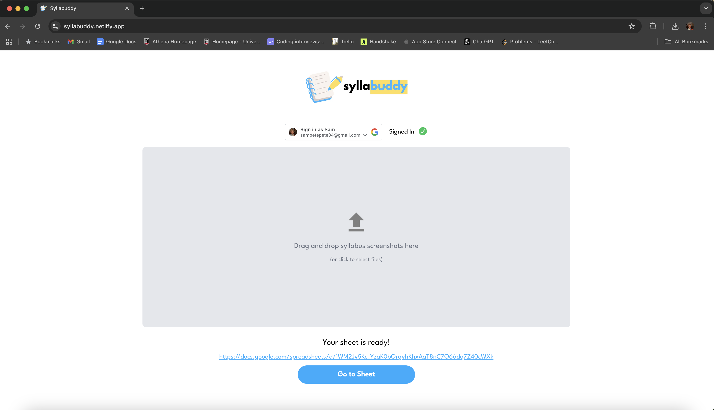

# Syllabuddy – From Syllabus Screenshot to Organized Spreadsheet

**Team:** Sam Peters

## Summary

Syllabuddy is a web application that streamlines academic planning by converting a syllabus screenshot into a structured Google Sheet. It uses Google Cloud Vision to extract text from images and intelligently parses it into tasks, dates, and descriptions. The resulting spreadsheet includes built-in formatting that helps students track assignments, deadlines, and progress effortlessly.

## Features

- Converts syllabus images into organized Google Sheets  
- Automatically extracts assignment names, due dates, and descriptions  
- Conditional formatting for upcoming deadlines and completed tasks  
- Mobile responsive for easy access on the go

## Tools & Technologies

- Google Cloud Vision API – for text extraction from syllabus images  
- Google Sheets API – for programmatically generating and updating spreadsheets  
- React – responsive frontend UI  
- JavaScript / Node.js – backend logic  
- Firebase – (optional) for authentication or storage

## Challenges & Solutions

Parsing diverse syllabus formats required a flexible and resilient text interpretation system. Some syllabi used bullet points and others used tables, which introduced complexity in how we structured spreadsheet rows. To address this, we used pattern-matching logic and fallback heuristics to handle edge cases.

Another challenge was aligning due dates to a calendar format and applying conditional formatting that visually prioritizes urgent or incomplete tasks. We added color-coded status flags and filters to enhance usability for students managing multiple classes.


This is a [Next.js](https://nextjs.org) project bootstrapped with [`create-next-app`](https://github.com/vercel/next.js/tree/canary/packages/create-next-app).

## Getting Started

First, run the development server:

```bash
npm run dev
# or
yarn dev
# or
pnpm dev
# or
bun dev
```

Open [http://localhost:3000](http://localhost:3000) with your browser to see the result.

You can start editing the page by modifying `app/page.js`. The page auto-updates as you edit the file.

This project uses [`next/font`](https://nextjs.org/docs/app/building-your-application/optimizing/fonts) to automatically optimize and load [Geist](https://vercel.com/font), a new font family for Vercel.

## Learn More

To learn more about Next.js, take a look at the following resources:

- [Next.js Documentation](https://nextjs.org/docs) - learn about Next.js features and API.
- [Learn Next.js](https://nextjs.org/learn) - an interactive Next.js tutorial.

You can check out [the Next.js GitHub repository](https://github.com/vercel/next.js) - your feedback and contributions are welcome!

## Deploy on Vercel

The easiest way to deploy your Next.js app is to use the [Vercel Platform](https://vercel.com/new?utm_medium=default-template&filter=next.js&utm_source=create-next-app&utm_campaign=create-next-app-readme) from the creators of Next.js.

Check out our [Next.js deployment documentation](https://nextjs.org/docs/app/building-your-application/deploying) for more details.
